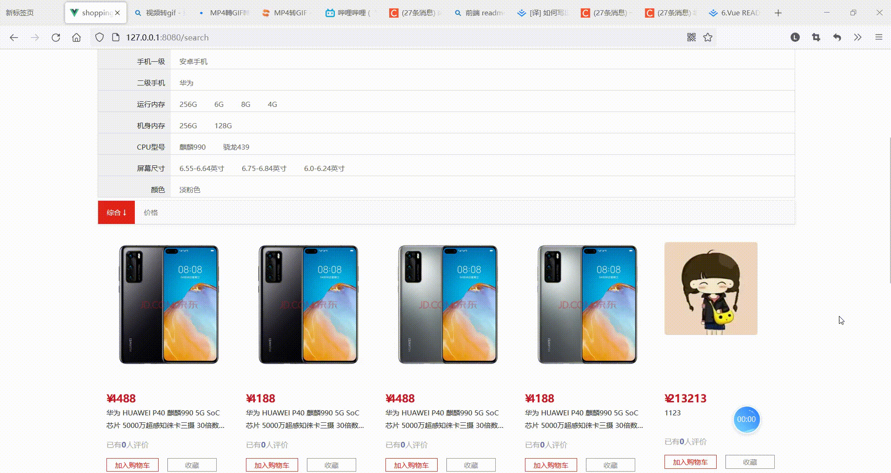

# 尚品汇Shopping Hui 电商项目(前台)


## 项目描述

1. 此项目为在线电商Web App (SPA)
2. 包括首页, 搜索列表, 商品详情, 购物车, 订单, 支付, 用户登陆/注册等多个子模块
3. 使用Vue全家桶+ES6++Webpack+Axios等前端技术
4.  采用模块化、组件化、工程化的模式开发


## 技术栈

### 前台数据处理 / 交互 /组件化

1. vue 2
2. vuex 3
3. vue-router 3

### 前后端交互

1.  axios
2. async/await
3. mockjs

### 模块化

1. ES6
2. babel

### 项目构建

1. webpack
2. vue-cli 3
3. eslint

### css预编译器

less

### 第三方库

1. loadsh
2. uuidjs
3. swiper


## 项目安装

```
npm install
```

### 编译与热加载（开发）

```
npm run serve
```

### 进行打包

```
npm run build
```

### Lints and fixes files

```
npm run lint
```


## 项目结构

│   .browserslistrc											
│  .eslintrc.js
│  .gitignore												// 忽略编译生成的中间文件
│  babel.config.js									   // babel配置文件
│  jsconfig.json										  // 配置src目录别名
│  package-lock.json								 // 模块与模块之间的依赖关系文件
│  package.json										// 全局规则配置文件
│  README.md
│  vue.config.js										// 关闭eslint语法检查
├─public
│  │  favicon.ico
│  │  home.css
│  │  index.html												// 主要入口文件
│  │  reset.css
│  │  
│  └─images
│          
└─src 													// 开发目录
    │  App.vue			
    │  main.js 			 										 // 项目主入口文件
    │  
    ├─api															// 请求接口
    │      index.js
    │      mockRequest.js
    │      request.js
    │      
    ├─assets														// 静态资源文件夹
    │  └─images
    │          
    ├─components												// 公共组件
    │  ├─Carousel
    │  │      index.vue
    │  │      
    │  ├─Footer
    │  │  │  Footer.vue
    │  │  │  
    │  │  └─images
    │  │          wx_cz.jpg
    │  │          
    │  ├─Header
    │  │  │  Header.vue
    │  │  │  
    │  │  └─images
    │  │          logo.png
    │  │          
    │  ├─Paginator
    │  │      index.vue
    │  │      
    │  └─ShopCart
    ├─mock																// 模拟数据
    │      banner.json
    │      floor.json
    │      mockServe.js
    │      
    ├─pages																// 项目页面
    │  ├─AddCartSuccess
    │  │      addCartSuccess.less
    │  │      index.vue
    │  │      
    │  ├─Detail
    │  │  │  detail.less
    │  │  │  index.vue
    │  │  │  
    │  │  ├─ImageList
    │  │  │      ImageList.vue
    │  │  │      
    │  │  ├─images
    │  │  │      
    │  │  └─Zoom
    │  │          Zoom.vue
    │  │          
    │  ├─HomePage
    │  │  │  HomePage.vue
    │  │  │  
    │  │  ├─Brand
    │  │  │  │  index.vue
    │  │  │  │  
    │  │  │  └─images
    │  │  │          
    │  │  ├─Floor
    │  │  │  │  index.vue
    │  │  │  │  
    │  │  │  └─images
    │  │  │          
    │  │  ├─images
    │  │  ├─Like
    │  │  │  │  index.vue
    │  │  │  │  
    │  │  │  └─images
    │  │  │          
    │  │  ├─ListContainer
    │  │  │  │  
    │  │  │  └─images
    │  │  │          
    │  │  ├─Rank
    │  │  │  │  index.vue
    │  │  │  │  
    │  │  │  └─images
    │  │  │          
    │  │  ├─Recommend
    │  │  │  │  index.vue
    │  │  │  │  
    │  │  │  └─images
    │  │  │          
    │  │  └─TypeNav
    │  │      │  TypeNav.less
    │  │      │  TypeNav.vue
    │  │      │  
    │  │      └─images
    │  ├─Login
    │  │  │  index.vue
    │  │  │  
    │  │  └─images
    │  │          
    │  ├─Register
    │  │      index.vue
    │  │      
    │  ├─SearchPage
    │  │  │  index.less
    │  │  │  SearchPage.vue
    │  │  │  
    │  │  ├─images
    │  │  │      
    │  │  └─SearchSelector
    │  │      │  SearchSelector.vue
    │  │      │  
    │  │      └─images
    │  │              
    │  ├─ShopCart
    │  │  │  index.vue
    │  │  │  shopcart.less
    │  │  │  
    │  │  └─images
    │  │          
    │  └─Trade
    │      │  index.vue
    │      │  Trade.less
    │      │  
    │      └─images
    │              choosed.png
    │              goods.png
    │              
    ├─router															// 路由文件目录
    │      index.js				
    │      route.js
    │      
    ├─store															// vuex 目录
    │  │  detail.js													// 商品详情模块
    │  │  index.js													// 主文件
    │  │  order.js													// 购买模块
    │  │  shopcart.js											  // 购物车模块
    │  │  user.js													 // 登录注册模块
    │  │  
    │  ├─home													  // 主页模块
    │  │  │  index.js
    │  │  │  
    │  │  └─banner												// 轮播图模块
    │  │          index.js
    │  │          
    │  └─search													 // 搜索模块
    │          index.js
    │          
    ├─utils															// 工具类		
    │      token.js												   // token 相关
    │      uuid.js													 // 游客uuid相关
    │

## 项目功能展示




商品详情页


分类导航+搜索+商品属性过滤


注册，登录，商品加入购物车


### 
