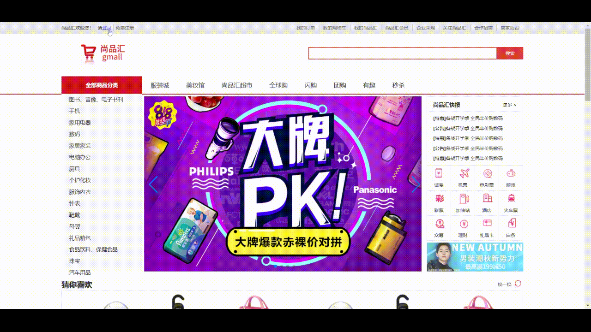
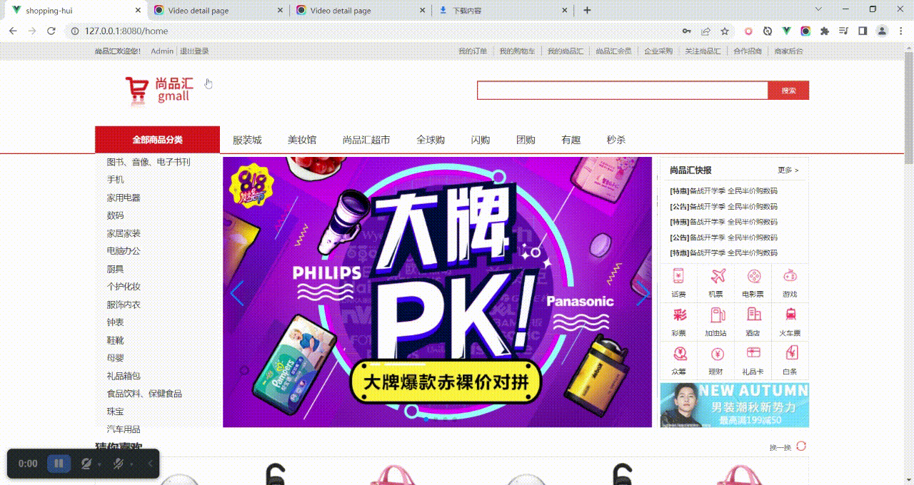
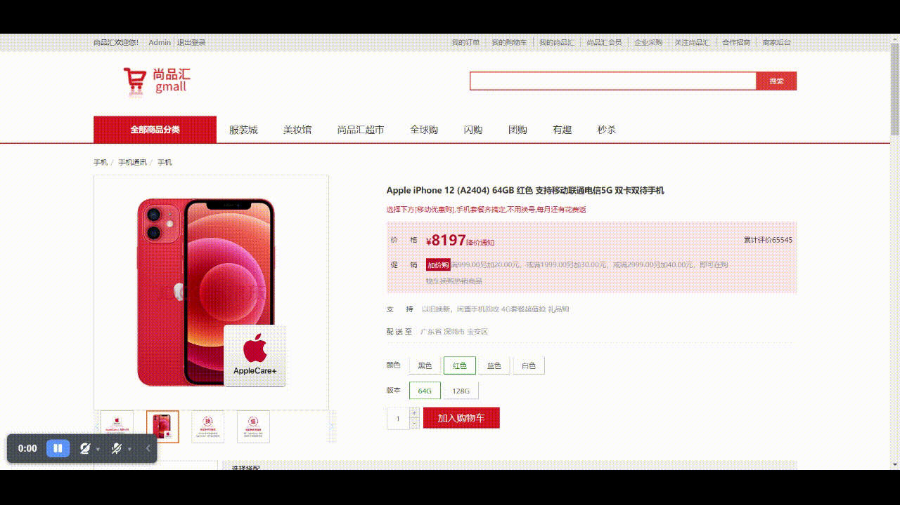
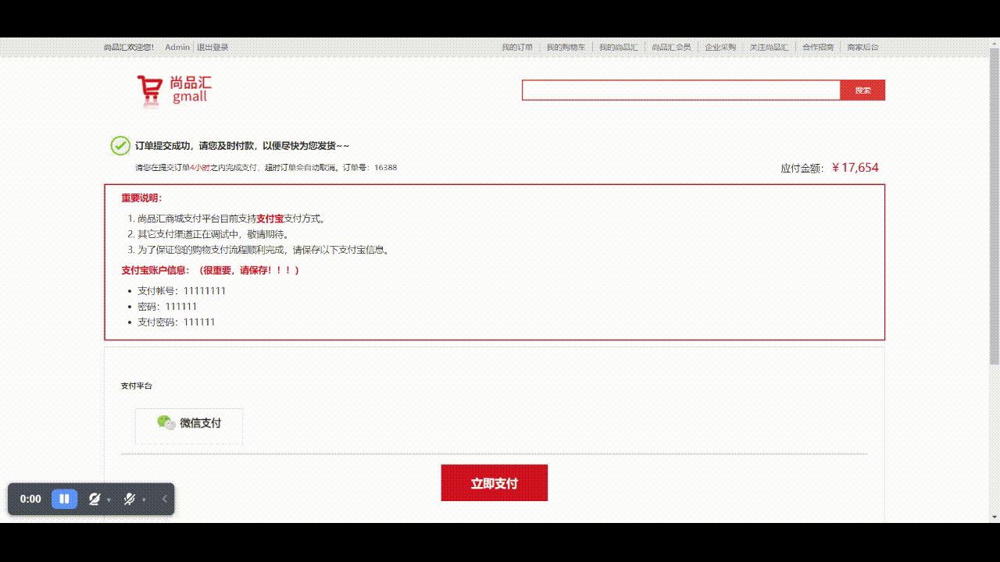

# 尚品汇Shopping Hui 电商项目(前台)


## 项目描述

1. 此项目为在线电商Web App (SPA)
2. 包括首页, 搜索列表, 商品详情, 购物车, 订单, 支付, 用户登陆/注册等多个子模块
3. 使用Vue全家桶+ES6++Webpack+Axios等前端技术
4.  采用模块化、组件化、工程化的模式开发


## 技术栈

### 前台数据处理 / 交互 /组件化

1. vue 2
2. vuex 3
3. vue-router 3

### 前后端交互

1.  axios
2. async/await
3. mockjs

### 模块化

1. ES6
2. babel

### 项目构建

1. webpack
2. vue-cli 3
3. eslint

### css预编译器

less

### 第三方库

1. loadsh
2. uuidjs
3. swiper


## 项目安装

```
npm install
```

### 编译与热加载（开发）

```
npm run serve
```

### 进行打包

```
npm run build
```

### Lints and fixes files

```
npm run lint
```


## 项目功能展示



登录


注册




登录状态下进入注册


浏览（分类+分页器）


搜索


商品详情


购物车(加入购物车)




下订单 





订单支付

### 
